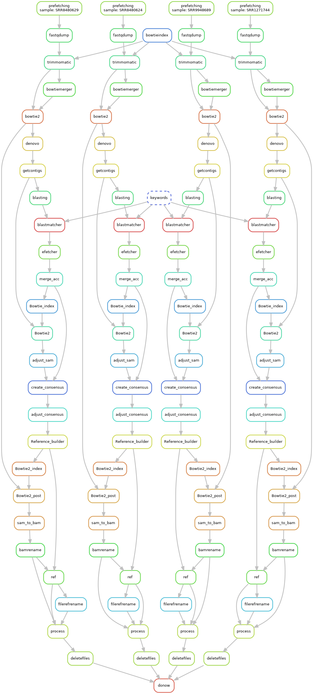

# Anopheles mosquitoes #
This projects main focus lies with the fully automating of a virus discovery pipeline which is demonstrated here with a case study Orthomyxo viruses and Anopheles mosquitoes. For this project samples were taken from the NCBI SRA database. 

## Table of content

- [Project description](#project-description)
- [Installation](#installation)
    * [Prerequisites](#prerequisites)
    * [Packages](#packages)
    * [Scripts and pipeline](#scripts-and-pipeline)
- [Contact](#contact)

## Project description
One of the main goals of this project will focus on building/updating an already existing pipeline and make it so that it is able to screen Anopheles data and map which viruses could be within the mosquito. This will also look for EVEs, but this is done in an already pre-existing pipeline.

Another goal for this project is that the mosquito data will be run through the pipeline and analysed, this will be done in order to see if any viruses are present within the mosquito and which viruses they may be

The final product that will reside within this repository is the  pipeline that can analyse the anopheles mosquito data and gives a representation in the form of a dag file in order to show the user what happened. This product is not specific to the Anopheles mosquito, but for this project the Anopheles mosquito was chosen as a case study

## Installation
For the complete repository please use the following piece of code inside the terminal:
```git clone https://github.com/jlalisan/Anopheles```

In order to run the project, please install the packages that are required and check their version, it may occur that a different version of a package does not have the same functions.

Note that the databases are not present within this repository, these can be manually chosen. A NCBI database can be chosen to use, or a spiked database can be made. An installation guide for the NCBI database is shown below.

### Prerequisites
* Python (3.7)
* Snakemake (7.14)
* SRA-toolkit (3.0.2)
* Bowtie2 (2.5.0)
* Ray-tools (2.3.1)
* Trimmomatic (0.39)
* Diamond blast (2.0.14)
* Lofreq (2.1.6)

For all the packages at least the versions mentioned above are required, any version below this may not have the same compatibility and similarly for higher versions the same argument can be made. With Python a higher version then 3.8 is not recommended since it then loses its plugin capabilities for 'Snakecharm' which runs snakemake within Pycharm.

Snakemake (7.14) can be installed via a command line input, this can be done for any engine, this does not have to be conda. ```conda install -c bioconda snakemake``` Furthermore a complete installation guide can be found [here](https://snakemake.readthedocs.io/en/stable/getting_started/installation.html).

The SRA-toolkit (3.0.2) can be cloned from the github via [SRA-toolkit](https://github.com/ncbi/sra-tools/wiki/02.-Installing-SRA-Toolkit) here a full installation guide is also shown for the first time user of this program. Do note that if there are multiple users and for the first time, the following argument needs to be used. 
```export PATH=$PATH:/path/to/sratoolkit/bin```
This needs to be done if the program has trouble finding the prefetch or the fasterq-dump application needed.

Bowtie2 (2.5.0) can be installed via the command line if this is not yet installed. Do note that Bowtie2 is *not* available for windows. The command to install this is: ```conda install -c bioconda Bowtie2``` Mamba or another engine can also be used for the installation process.

Ray-tools (2.3.1) are used for the assembly process within the pipeline and can be found [here](https://github.com/sebhtml/Ray-Releases) do note that t another version could potentially not work.

For the trimming process the Trimmomatic 0.39 jar is required along with the adapter sequences unless the user has their own adapters. The jar can be downloaded [here](http://www.usadellab.org/cms/?page=trimmomatic). Another version can be used but is not guaranteed to give the same or correct answers.

Diamond blast (2.0.14) is used to see if there are viruses within the data and for a full guide and download information the [github link](https://github.com/bbuchfink/diamond) or directly via [NCBI](https://blast.ncbi.nlm.nih.gov/Blast.cgi?PAGE_TYPE=BlastDocs&DOC_TYPE=Download). Any required database can also be downloaded via this same link.

The Lofreq tool (2.1.6) is used in the final stage of the post processing to create the VCF files, this can be obtained via [this link](https://github.com/CSB5/lofreq/tree/master/dist). An installation guide is included within the repository

### Packages
|Name                                   |Version              |   
|---                                    |---                  |
|os                                     |Varies per device    |
|re                                     |2022.6.2             |
|subprocess                             |3.7                  |

The packages used within this pipeline are used with Python version 3.7, any version above 3.7 should also work. Do note that these packages are for the Snakemake scripts and not the python scripts within the repository. 

### Scripts and pipeline
The pipeline consists of three main scripts. Pre-processing, processing and post-processing. These are all included within Main.smk. To call the scripts enter the following ```snakemake --snakefile main.smk --jobs --keep-going --allow-ambiguity``` with this command it is ensured the entire process finishes even if a file cannot be found due to a human error with the input.

For the pipeline input the following steps are taken:


The image above shows four samples running in parallel, once all the samples are marked down in the configuration file the program only needs to be started once.

`rule prefetching:` Prefetches the files from the config.  

`rule fastq_dump`: Downloads the prefetched files.  

`rule bowtieindex:` Creates the Bowtie index from the reference genome.  

`rule trimmomatic:` Trims the files with the config parameters.  

`rule bowtiemerger:` Merges the paired files received from trimmomatic.  

`rule Bowtie2:` Maps the files.

`rule denovo:` Assembles the files and creates contigs.

`rule get_contigs:`Moves the contigs to the correct position.

`rule blasting:` Uses diamond blast according to config.  

`rule keywords:` Uses Keywords.py to get the correct keywords.  

`rule blastmatcher:`Matches the outcome to the keywords to identify viruses.  

`rule efetcher:` Efetches the viral sequences.  

`rule merge_acc:` Merges the efetched files.  

`rule bowtieindex:` Creates the Bowtie index for the processing.  

`rule Bowtie2:`Maps the new references to the contigs.  

`rule adjust_sam:`Corrects any duplicates within the SAM file.  

`rule create_consensus:` Creates a consensus sequence.    

`rule adjust_consencus:` Adjusts the consensus sequence to use the SRR name.   

`rule reference_builder:` Builds the references for use.  

`rule Bowtie2_index:` Builds the Bowtie index for post processing.    

`rule Bowtie2_post:` Maps the processed files.   

`rule sam_to_bam:` Makes the SAM files to BAM files.   

`rule bamrename:`Corrects the expanded name for usage (BAM file).  

`rule ref:` Creates the references for the processing.   

`rule reffilerename:` Renames the incorrectly named references and moves these.  

`rule process:` Processes the BAM files to .vcf files.  

`rule delete_files:` Deletes the files that were used.  

In order to run the pipeline the user will need to have all the tools in the correct locations that correspond to that paths, any errors that do appear will be logged in the log files. The script can be run in two parts, either the total script or the pre-processing and the post-processing with a manual mapping, and consensus procedure in between. 

## Contact
* Lisan Eisinga
  * j.l.a.eisinga@st.hanze.nl 